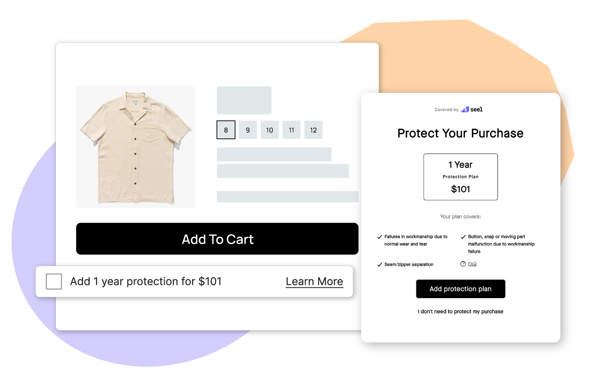

<div align="center">

[](https://seel.com)

# Seel<a id="seel"></a>

Seel API


</div>

## Table of Contents<a id="table-of-contents"></a>

<!-- toc -->

- [Requirements](#requirements)
- [Installation](#installation)
- [Getting Started](#getting-started)
- [Async](#async)
- [Raw HTTP Response](#raw-http-response)
- [Reference](#reference)
  * [`seel.claim.get_all_claims`](#seelclaimget_all_claims)
  * [`seel.claim.get_by_id`](#seelclaimget_by_id)
  * [`seel.contract.get_by_id`](#seelcontractget_by_id)
  * [`seel.contract.list_contracts`](#seelcontractlist_contracts)
  * [`seel.event.create_new_event`](#seeleventcreate_new_event)
  * [`seel.fulfillment.cancel_fulfillment`](#seelfulfillmentcancel_fulfillment)
  * [`seel.fulfillment.create_new_fulfillment`](#seelfulfillmentcreate_new_fulfillment)
  * [`seel.fulfillment.get_details`](#seelfulfillmentget_details)
  * [`seel.fulfillment.list_fulfillments`](#seelfulfillmentlist_fulfillments)
  * [`seel.fulfillment.update_fulfillment_details`](#seelfulfillmentupdate_fulfillment_details)
  * [`seel.invoice.get_invoice_by_id`](#seelinvoiceget_invoice_by_id)
  * [`seel.invoice.list_invoices`](#seelinvoicelist_invoices)
  * [`seel.merchant.create_new_merchant`](#seelmerchantcreate_new_merchant)
  * [`seel.merchant.get_merchant_details`](#seelmerchantget_merchant_details)
  * [`seel.merchant.list_all_merchants`](#seelmerchantlist_all_merchants)
  * [`seel.merchant.update_merchant_details`](#seelmerchantupdate_merchant_details)
  * [`seel.order.batch_create_orders`](#seelorderbatch_create_orders)
  * [`seel.order.cancel_order_by_id`](#seelordercancel_order_by_id)
  * [`seel.order.create_new_order`](#seelordercreate_new_order)
  * [`seel.order.get_by_id`](#seelorderget_by_id)
  * [`seel.order.update_order_details`](#seelorderupdate_order_details)
  * [`seel.product.add_new_product`](#seelproductadd_new_product)
  * [`seel.product.batch_create_products`](#seelproductbatch_create_products)
  * [`seel.product.get_product_by_id`](#seelproductget_product_by_id)
  * [`seel.product.list_plans`](#seelproductlist_plans)
  * [`seel.product.remove_product_by_id`](#seelproductremove_product_by_id)
  * [`seel.product.update_product_details`](#seelproductupdate_product_details)
  * [`seel.quote.generate_quote`](#seelquotegenerate_quote)
  * [`seel.quote.get_by_id`](#seelquoteget_by_id)

<!-- tocstop -->

## Requirements<a id="requirements"></a>

Python >=3.7

## Installation<a id="installation"></a>
<div align="center">
  <a href="https://konfigthis.com/sdk-sign-up?company=Seel&language=Python">
    
  </a>
</div>

## Getting Started<a id="getting-started"></a>

```python
from pprint import pprint
from seel_python_sdk import Seel, ApiException

seel = Seel(
)

try:
    # List claims
    get_all_claims_response = seel.claim.get_all_claims(
        x_seel_api_key="e2b4f9c8d3a7e6d2f5b0c4a1d8e9b6",
        x_seel_api_version="1.3.0",
        partner="seel",
        order_id="string_example",
        page=0,
        page_size=100,
    )
    print(get_all_claims_response)
except ApiException as e:
    print("Exception when calling ClaimApi.get_all_claims: %s\n" % e)
    pprint(e.body)
    pprint(e.headers)
    pprint(e.status)
    pprint(e.reason)
    pprint(e.round_trip_time)
```

## Async<a id="async"></a>

`async` support is available by prepending `a` to any method.

```python

import asyncio
from pprint import pprint
from seel_python_sdk import Seel, ApiException

seel = Seel(
)

async def main():
    try:
        # List claims
        get_all_claims_response = await seel.claim.aget_all_claims(
            x_seel_api_key="e2b4f9c8d3a7e6d2f5b0c4a1d8e9b6",
            x_seel_api_version="1.3.0",
            partner="seel",
            order_id="string_example",
            page=0,
            page_size=100,
        )
        print(get_all_claims_response)
    except ApiException as e:
        print("Exception when calling ClaimApi.get_all_claims: %s\n" % e)
        pprint(e.body)
        pprint(e.headers)
        pprint(e.status)
        pprint(e.reason)
        pprint(e.round_trip_time)

asyncio.run(main())
```

## Raw HTTP Response<a id="raw-http-response"></a>

To access raw HTTP response values, use the `.raw` namespace.

```python
from pprint import pprint
from seel_python_sdk import Seel, ApiException

seel = Seel(
)

try:
    # List claims
    get_all_claims_response = seel.claim.raw.get_all_claims(
        x_seel_api_key="e2b4f9c8d3a7e6d2f5b0c4a1d8e9b6",
        x_seel_api_version="1.3.0",
        partner="seel",
        order_id="string_example",
        page=0,
        page_size=100,
    )
    pprint(get_all_claims_response.body)
    pprint(get_all_claims_response.body["page"])
    pprint(get_all_claims_response.body["page_size"])
    pprint(get_all_claims_response.body["total"])
    pprint(get_all_claims_response.body["claims"])
    pprint(get_all_claims_response.headers)
    pprint(get_all_claims_response.status)
    pprint(get_all_claims_response.round_trip_time)
except ApiException as e:
    print("Exception when calling ClaimApi.get_all_claims: %s\n" % e)
    pprint(e.body)
    pprint(e.headers)
    pprint(e.status)
    pprint(e.reason)
    pprint(e.round_trip_time)
```


## Reference<a id="reference"></a>
### `seel.claim.get_all_claims`<a id="seelclaimget_all_claims"></a>

List claims

#### 🛠️ Usage<a id="🛠️-usage"></a>

```python
get_all_claims_response = seel.claim.get_all_claims(
    x_seel_api_key="e2b4f9c8d3a7e6d2f5b0c4a1d8e9b6",
    x_seel_api_version="1.3.0",
    partner="seel",
    order_id="string_example",
    page=0,
    page_size=100,
)
```

#### ⚙️ Parameters<a id="⚙️-parameters"></a>

##### x_seel_api_key: `str`<a id="x_seel_api_key-str"></a>

Your Seel API key

##### x_seel_api_version: `str`<a id="x_seel_api_version-str"></a>

Version of the Seel API to use

##### partner: `str`<a id="partner-str"></a>

partner name

##### order_id: `str`<a id="order_id-str"></a>

Query by order ID

##### page: `int`<a id="page-int"></a>

Query by page, default 0

##### page_size: `int`<a id="page_size-int"></a>

Query by page_size, default 100

#### 🔄 Return<a id="🔄-return"></a>

[`ClaimGetAllClaimsResponse`](./seel_python_sdk/pydantic/claim_get_all_claims_response.py)

#### 🌐 Endpoint<a id="🌐-endpoint"></a>

`/{partner}/claims` `get`

[🔙 **Back to Table of Contents**](#table-of-contents)

---

### `seel.claim.get_by_id`<a id="seelclaimget_by_id"></a>

Get a claim

#### 🛠️ Usage<a id="🛠️-usage"></a>

```python
get_by_id_response = seel.claim.get_by_id(
    claim_id="claim_id_example",
    x_seel_api_key="e2b4f9c8d3a7e6d2f5b0c4a1d8e9b6",
    x_seel_api_version="1.3.0",
    partner="seel",
)
```

#### ⚙️ Parameters<a id="⚙️-parameters"></a>

##### claim_id: `str`<a id="claim_id-str"></a>

ID of the claim

##### x_seel_api_key: `str`<a id="x_seel_api_key-str"></a>

Your Seel API key

##### x_seel_api_version: `str`<a id="x_seel_api_version-str"></a>

Version of the Seel API to use

##### partner: `str`<a id="partner-str"></a>

partner name

#### 🔄 Return<a id="🔄-return"></a>

[`Claim`](./seel_python_sdk/pydantic/claim.py)

#### 🌐 Endpoint<a id="🌐-endpoint"></a>

`/{partner}/claims/{claim_id}` `get`

[🔙 **Back to Table of Contents**](#table-of-contents)

---

### `seel.contract.get_by_id`<a id="seelcontractget_by_id"></a>

Get a contract

#### 🛠️ Usage<a id="🛠️-usage"></a>

```python
get_by_id_response = seel.contract.get_by_id(
    contract_id="contract_id_example",
    x_seel_api_key="e2b4f9c8d3a7e6d2f5b0c4a1d8e9b6",
    x_seel_api_version="1.3.0",
    partner="seel",
)
```

#### ⚙️ Parameters<a id="⚙️-parameters"></a>

##### contract_id: `str`<a id="contract_id-str"></a>

ID of the contract

##### x_seel_api_key: `str`<a id="x_seel_api_key-str"></a>

Your Seel API key

##### x_seel_api_version: `str`<a id="x_seel_api_version-str"></a>

Version of the Seel API to use

##### partner: `str`<a id="partner-str"></a>

partner name

#### 🔄 Return<a id="🔄-return"></a>

[`Contract`](./seel_python_sdk/pydantic/contract.py)

#### 🌐 Endpoint<a id="🌐-endpoint"></a>

`/{partner}/contracts/{contract_id}` `get`

[🔙 **Back to Table of Contents**](#table-of-contents)

---

### `seel.contract.list_contracts`<a id="seelcontractlist_contracts"></a>

List contracts

#### 🛠️ Usage<a id="🛠️-usage"></a>

```python
list_contracts_response = seel.contract.list_contracts(
    x_seel_api_key="e2b4f9c8d3a7e6d2f5b0c4a1d8e9b6",
    x_seel_api_version="1.3.0",
    partner="seel",
    order_id="string_example",
    page=0,
    page_size=100,
)
```

#### ⚙️ Parameters<a id="⚙️-parameters"></a>

##### x_seel_api_key: `str`<a id="x_seel_api_key-str"></a>

Your Seel API key

##### x_seel_api_version: `str`<a id="x_seel_api_version-str"></a>

Version of the Seel API to use

##### partner: `str`<a id="partner-str"></a>

partner name

##### order_id: `str`<a id="order_id-str"></a>

Query by order ID

##### page: `int`<a id="page-int"></a>

Query by page, default 0

##### page_size: `int`<a id="page_size-int"></a>

Query by page_size, default 100

#### 🔄 Return<a id="🔄-return"></a>

[`ContractListContractsResponse`](./seel_python_sdk/pydantic/contract_list_contracts_response.py)

#### 🌐 Endpoint<a id="🌐-endpoint"></a>

`/{partner}/contracts` `get`

[🔙 **Back to Table of Contents**](#table-of-contents)

---

### `seel.event.create_new_event`<a id="seeleventcreate_new_event"></a>

Create events

#### 🛠️ Usage<a id="🛠️-usage"></a>

```python
create_new_event_response = seel.event.create_new_event(
    session_id="1680749645592",
    customer_id="229413056",
    event_source="web",
    event_type="cart_add",
    event_info={},
    x_seel_api_key="e2b4f9c8d3a7e6d2f5b0c4a1d8e9b6",
    x_seel_api_version="1.3.0",
    partner="seel",
    event_ts="1680749645592",
    device_id="3kGv6F1i8L",
    client_ip="64.64.230.190",
)
```

#### ⚙️ Parameters<a id="⚙️-parameters"></a>

##### session_id: `str`<a id="session_id-str"></a>

Session ID

##### customer_id: `str`<a id="customer_id-str"></a>

Customer ID

##### event_source: `str`<a id="event_source-str"></a>

Event source

##### event_type: `str`<a id="event_type-str"></a>

Event type

##### event_info: `Dict[str, Union[bool, date, datetime, dict, float, int, list, str, None]]`<a id="event_info-dictstr-unionbool-date-datetime-dict-float-int-list-str-none"></a>

Each event_type has its own unique schema. For specific details, please refer to the custom pixel guide.

##### x_seel_api_key: `str`<a id="x_seel_api_key-str"></a>

Your Seel API key

##### x_seel_api_version: `str`<a id="x_seel_api_version-str"></a>

Version of the Seel API to use

##### partner: `str`<a id="partner-str"></a>

partner name

##### event_ts: `str`<a id="event_ts-str"></a>

Event created timestamp in milliseconds

##### device_id: `str`<a id="device_id-str"></a>

Device ID

##### client_ip: `str`<a id="client_ip-str"></a>

Browser IP address

#### ⚙️ Request Body<a id="⚙️-request-body"></a>

[`EventCreateNewEventRequest`](./seel_python_sdk/type/event_create_new_event_request.py)
#### 🔄 Return<a id="🔄-return"></a>

[`Event`](./seel_python_sdk/pydantic/event.py)

#### 🌐 Endpoint<a id="🌐-endpoint"></a>

`/{partner}/events` `post`

[🔙 **Back to Table of Contents**](#table-of-contents)

---

### `seel.fulfillment.cancel_fulfillment`<a id="seelfulfillmentcancel_fulfillment"></a>

Cancel a fulfillment

#### 🛠️ Usage<a id="🛠️-usage"></a>

```python
cancel_fulfillment_response = seel.fulfillment.cancel_fulfillment(
    order_id="order_id_example",
    fulfillment_id="fulfillment_id_example",
    x_seel_api_key="e2b4f9c8d3a7e6d2f5b0c4a1d8e9b6",
    x_seel_api_version="1.3.0",
    partner="seel",
)
```

#### ⚙️ Parameters<a id="⚙️-parameters"></a>

##### order_id: `str`<a id="order_id-str"></a>

ID of the order

##### fulfillment_id: `str`<a id="fulfillment_id-str"></a>

ID of the fulfillment

##### x_seel_api_key: `str`<a id="x_seel_api_key-str"></a>

Your Seel API key

##### x_seel_api_version: `str`<a id="x_seel_api_version-str"></a>

Version of the Seel API to use

##### partner: `str`<a id="partner-str"></a>

partner name

#### 🔄 Return<a id="🔄-return"></a>

[`Fulfillment`](./seel_python_sdk/pydantic/fulfillment.py)

#### 🌐 Endpoint<a id="🌐-endpoint"></a>

`/{partner}/orders/{order_id}/fulfillments/{fulfillment_id}/cancel` `post`

[🔙 **Back to Table of Contents**](#table-of-contents)

---

### `seel.fulfillment.create_new_fulfillment`<a id="seelfulfillmentcreate_new_fulfillment"></a>

Create a fulfillment

#### 🛠️ Usage<a id="🛠️-usage"></a>

```python
create_new_fulfillment_response = seel.fulfillment.create_new_fulfillment(
    fulfillment_id="fulfillment_id",
    created_ts="1686049398000",
    updated_ts="1686049398000",
    tracking_number="YT1231232113",
    carrier="USPS",
    shipment_status="delivered",
    line_items=[
        {
            "line_item_id": "12345678",
            "quantity": 1,
        }
    ],
    order_id="order_id_example",
    x_seel_api_key="e2b4f9c8d3a7e6d2f5b0c4a1d8e9b6",
    x_seel_api_version="1.3.0",
    partner="seel",
    tracking_url="https://tools.usps.com/go/TrackConfirmAction_input",
)
```

#### ⚙️ Parameters<a id="⚙️-parameters"></a>

##### fulfillment_id: `str`<a id="fulfillment_id-str"></a>

Fulfillment ID

##### created_ts: `datetime`<a id="created_ts-datetime"></a>

Fulfillment created timestamp in milliseconds

##### updated_ts: `datetime`<a id="updated_ts-datetime"></a>

Fulfillment updated timestamp in milliseconds

##### tracking_number: `str`<a id="tracking_number-str"></a>

The tracking number of the fulfillment

##### carrier: `str`<a id="carrier-str"></a>

The shipping carrier of the fulfillment

##### shipment_status: `str`<a id="shipment_status-str"></a>

The shipping status of the fulfillment

##### line_items: [`FulfillmentLineItems`](./seel_python_sdk/type/fulfillment_line_items.py)<a id="line_items-fulfillmentlineitemsseel_python_sdktypefulfillment_line_itemspy"></a>

##### order_id: `str`<a id="order_id-str"></a>

ID of the order

##### x_seel_api_key: `str`<a id="x_seel_api_key-str"></a>

Your Seel API key

##### x_seel_api_version: `str`<a id="x_seel_api_version-str"></a>

Version of the Seel API to use

##### partner: `str`<a id="partner-str"></a>

partner name

##### tracking_url: `str`<a id="tracking_url-str"></a>

The tracking url of the fulfillment

#### ⚙️ Request Body<a id="⚙️-request-body"></a>

[`Fulfillment`](./seel_python_sdk/type/fulfillment.py)
#### 🔄 Return<a id="🔄-return"></a>

[`Fulfillment`](./seel_python_sdk/pydantic/fulfillment.py)

#### 🌐 Endpoint<a id="🌐-endpoint"></a>

`/{partner}/orders/{order_id}/fulfillments` `post`

[🔙 **Back to Table of Contents**](#table-of-contents)

---

### `seel.fulfillment.get_details`<a id="seelfulfillmentget_details"></a>

Get a fulfillment

#### 🛠️ Usage<a id="🛠️-usage"></a>

```python
get_details_response = seel.fulfillment.get_details(
    order_id="order_id_example",
    fulfillment_id="fulfillment_id_example",
    x_seel_api_key="e2b4f9c8d3a7e6d2f5b0c4a1d8e9b6",
    x_seel_api_version="1.3.0",
    partner="seel",
)
```

#### ⚙️ Parameters<a id="⚙️-parameters"></a>

##### order_id: `str`<a id="order_id-str"></a>

ID of the order

##### fulfillment_id: `str`<a id="fulfillment_id-str"></a>

ID of the fulfillment

##### x_seel_api_key: `str`<a id="x_seel_api_key-str"></a>

Your Seel API key

##### x_seel_api_version: `str`<a id="x_seel_api_version-str"></a>

Version of the Seel API to use

##### partner: `str`<a id="partner-str"></a>

partner name

#### 🔄 Return<a id="🔄-return"></a>

[`Fulfillment`](./seel_python_sdk/pydantic/fulfillment.py)

#### 🌐 Endpoint<a id="🌐-endpoint"></a>

`/{partner}/orders/{order_id}/fulfillments/{fulfillment_id}` `get`

[🔙 **Back to Table of Contents**](#table-of-contents)

---

### `seel.fulfillment.list_fulfillments`<a id="seelfulfillmentlist_fulfillments"></a>

List fulfillments

#### 🛠️ Usage<a id="🛠️-usage"></a>

```python
list_fulfillments_response = seel.fulfillment.list_fulfillments(
    order_id="order_id_example",
    x_seel_api_key="e2b4f9c8d3a7e6d2f5b0c4a1d8e9b6",
    x_seel_api_version="1.3.0",
    partner="seel",
    page=0,
    page_size=100,
)
```

#### ⚙️ Parameters<a id="⚙️-parameters"></a>

##### order_id: `str`<a id="order_id-str"></a>

ID of the order

##### x_seel_api_key: `str`<a id="x_seel_api_key-str"></a>

Your Seel API key

##### x_seel_api_version: `str`<a id="x_seel_api_version-str"></a>

Version of the Seel API to use

##### partner: `str`<a id="partner-str"></a>

partner name

##### page: `int`<a id="page-int"></a>

Query by page, default 0

##### page_size: `int`<a id="page_size-int"></a>

Query by page_size, default 100

#### 🔄 Return<a id="🔄-return"></a>

[`FulfillmentListFulfillmentsResponse`](./seel_python_sdk/pydantic/fulfillment_list_fulfillments_response.py)

#### 🌐 Endpoint<a id="🌐-endpoint"></a>

`/{partner}/orders/{order_id}/fulfillments` `get`

[🔙 **Back to Table of Contents**](#table-of-contents)

---

### `seel.fulfillment.update_fulfillment_details`<a id="seelfulfillmentupdate_fulfillment_details"></a>

Update a fulfillment

#### 🛠️ Usage<a id="🛠️-usage"></a>

```python
update_fulfillment_details_response = seel.fulfillment.update_fulfillment_details(
    updated_ts="1686049398000",
    tracking_number="YT1231232113",
    carrier="USPS",
    shipment_status="delivered",
    line_items=[
        {
            "line_item_id": "12345678",
            "quantity": 1,
        }
    ],
    order_id="order_id_example",
    fulfillment_id="fulfillment_id_example",
    x_seel_api_key="e2b4f9c8d3a7e6d2f5b0c4a1d8e9b6",
    x_seel_api_version="1.3.0",
    partner="seel",
    tracking_url="https://tools.usps.com/go/TrackConfirmAction_input",
)
```

#### ⚙️ Parameters<a id="⚙️-parameters"></a>

##### updated_ts: `datetime`<a id="updated_ts-datetime"></a>

Fulfillment updated timestamp in milliseconds

##### tracking_number: `str`<a id="tracking_number-str"></a>

The tracking number of the fulfillment

##### carrier: `str`<a id="carrier-str"></a>

The shipping carrier of the fulfillment

##### shipment_status: `str`<a id="shipment_status-str"></a>

The shipping status of the fulfillment

##### line_items: [`FulfillmentUpdateFulfillmentDetailsRequestLineItems`](./seel_python_sdk/type/fulfillment_update_fulfillment_details_request_line_items.py)<a id="line_items-fulfillmentupdatefulfillmentdetailsrequestlineitemsseel_python_sdktypefulfillment_update_fulfillment_details_request_line_itemspy"></a>

##### order_id: `str`<a id="order_id-str"></a>

ID of the order

##### fulfillment_id: `str`<a id="fulfillment_id-str"></a>

ID of the fulfillment

##### x_seel_api_key: `str`<a id="x_seel_api_key-str"></a>

Your Seel API key

##### x_seel_api_version: `str`<a id="x_seel_api_version-str"></a>

Version of the Seel API to use

##### partner: `str`<a id="partner-str"></a>

partner name

##### tracking_url: `str`<a id="tracking_url-str"></a>

The tracking url of the fulfillment

#### ⚙️ Request Body<a id="⚙️-request-body"></a>

[`FulfillmentUpdateFulfillmentDetailsRequest`](./seel_python_sdk/type/fulfillment_update_fulfillment_details_request.py)
#### 🔄 Return<a id="🔄-return"></a>

[`Fulfillment`](./seel_python_sdk/pydantic/fulfillment.py)

#### 🌐 Endpoint<a id="🌐-endpoint"></a>

`/{partner}/orders/{order_id}/fulfillments/{fulfillment_id}` `post`

[🔙 **Back to Table of Contents**](#table-of-contents)

---

### `seel.invoice.get_invoice_by_id`<a id="seelinvoiceget_invoice_by_id"></a>

Get an invoice

#### 🛠️ Usage<a id="🛠️-usage"></a>

```python
get_invoice_by_id_response = seel.invoice.get_invoice_by_id(
    invoice_id="12345",
    x_seel_api_key="e2b4f9c8d3a7e6d2f5b0c4a1d8e9b6",
    x_seel_api_version="1.3.0",
    partner="seel",
)
```

#### ⚙️ Parameters<a id="⚙️-parameters"></a>

##### invoice_id: `str`<a id="invoice_id-str"></a>

ID of the invoice

##### x_seel_api_key: `str`<a id="x_seel_api_key-str"></a>

Your Seel API key

##### x_seel_api_version: `str`<a id="x_seel_api_version-str"></a>

Version of the Seel API to use

##### partner: `str`<a id="partner-str"></a>

partner name

#### 🔄 Return<a id="🔄-return"></a>

[`Invoice`](./seel_python_sdk/pydantic/invoice.py)

#### 🌐 Endpoint<a id="🌐-endpoint"></a>

`/{partner}/invoices/{invoice_id}` `get`

[🔙 **Back to Table of Contents**](#table-of-contents)

---

### `seel.invoice.list_invoices`<a id="seelinvoicelist_invoices"></a>

List invoices

#### 🛠️ Usage<a id="🛠️-usage"></a>

```python
list_invoices_response = seel.invoice.list_invoices(
    x_seel_api_key="e2b4f9c8d3a7e6d2f5b0c4a1d8e9b6",
    x_seel_api_version="1.3.0",
    partner="seel",
    page=0,
    page_size=100,
)
```

#### ⚙️ Parameters<a id="⚙️-parameters"></a>

##### x_seel_api_key: `str`<a id="x_seel_api_key-str"></a>

Your Seel API key

##### x_seel_api_version: `str`<a id="x_seel_api_version-str"></a>

Version of the Seel API to use

##### partner: `str`<a id="partner-str"></a>

partner name

##### page: `int`<a id="page-int"></a>

Query by page, default 0

##### page_size: `int`<a id="page_size-int"></a>

Query by page_size, default 100

#### 🔄 Return<a id="🔄-return"></a>

[`InvoiceListInvoicesResponse`](./seel_python_sdk/pydantic/invoice_list_invoices_response.py)

#### 🌐 Endpoint<a id="🌐-endpoint"></a>

`/{partner}/invoices` `get`

[🔙 **Back to Table of Contents**](#table-of-contents)

---

### `seel.merchant.create_new_merchant`<a id="seelmerchantcreate_new_merchant"></a>

Create a merchant

#### 🛠️ Usage<a id="🛠️-usage"></a>

```python
create_new_merchant_response = seel.merchant.create_new_merchant(
    shop_id="shop123",
    admin_domain="shop.myshopify.com",
    shop_domain="www.myshop.com",
    shop_platform="Shopify",
    shop_currency="USD",
    shop_name="My Shop",
    contact_name="My Shop",
    contact_email="contact@myshop.com",
    seel_services=[
        {
            "type": "seel-ra",
            "is_enabled": True,
            "is_default_on": True,
        }
    ],
    x_seel_api_key="e2b4f9c8d3a7e6d2f5b0c4a1d8e9b6",
    x_seel_api_version="1.3.0",
    partner="seel",
    contact_phone_number="555-1234",
)
```

#### ⚙️ Parameters<a id="⚙️-parameters"></a>

##### shop_id: `str`<a id="shop_id-str"></a>

The identifier for the shop or store within the partner's platform.

##### admin_domain: `str`<a id="admin_domain-str"></a>

The original subdomain domain for the shop provided by the ecommerce platform, e.g. subdomain.myshopify.com

##### shop_domain: `str`<a id="shop_domain-str"></a>

The custom domain name assigned to the shop, e.g. www.myshop.com.

##### shop_platform: `str`<a id="shop_platform-str"></a>

The source ecommerce platform for the shop, e.g. Shopify, BigCommerce.

##### shop_currency: `str`<a id="shop_currency-str"></a>

3-letter ISO 4217 currency code for the primary currency used in the shop, e.g. USD, EUR.

##### shop_name: `str`<a id="shop_name-str"></a>

The registered business name for the shop.

##### contact_name: `str`<a id="contact_name-str"></a>

The registered business name for the merchant.

##### contact_email: `str`<a id="contact_email-str"></a>

The contact email address on file for the merchant.

##### seel_services: [`MerchantCreateNewMerchantRequestSeelServices`](./seel_python_sdk/type/merchant_create_new_merchant_request_seel_services.py)<a id="seel_services-merchantcreatenewmerchantrequestseelservicesseel_python_sdktypemerchant_create_new_merchant_request_seel_servicespy"></a>

##### x_seel_api_key: `str`<a id="x_seel_api_key-str"></a>

Your Seel API key

##### x_seel_api_version: `str`<a id="x_seel_api_version-str"></a>

Version of the Seel API to use

##### partner: `str`<a id="partner-str"></a>

partner name

##### contact_phone_number: `str`<a id="contact_phone_number-str"></a>

The phone number on file for the merchant.

#### ⚙️ Request Body<a id="⚙️-request-body"></a>

[`MerchantCreateNewMerchantRequest`](./seel_python_sdk/type/merchant_create_new_merchant_request.py)
#### 🔄 Return<a id="🔄-return"></a>

[`Merchant`](./seel_python_sdk/pydantic/merchant.py)

#### 🌐 Endpoint<a id="🌐-endpoint"></a>

`/{partner}/merchants` `post`

[🔙 **Back to Table of Contents**](#table-of-contents)

---

### `seel.merchant.get_merchant_details`<a id="seelmerchantget_merchant_details"></a>

Get a merchant

#### 🛠️ Usage<a id="🛠️-usage"></a>

```python
get_merchant_details_response = seel.merchant.get_merchant_details(
    merchant_id="merchant_id_example",
    x_seel_api_key="e2b4f9c8d3a7e6d2f5b0c4a1d8e9b6",
    x_seel_api_version="1.3.0",
    partner="seel",
)
```

#### ⚙️ Parameters<a id="⚙️-parameters"></a>

##### merchant_id: `str`<a id="merchant_id-str"></a>

ID of the merchant

##### x_seel_api_key: `str`<a id="x_seel_api_key-str"></a>

Your Seel API key

##### x_seel_api_version: `str`<a id="x_seel_api_version-str"></a>

Version of the Seel API to use

##### partner: `str`<a id="partner-str"></a>

partner name

#### 🔄 Return<a id="🔄-return"></a>

[`Merchant`](./seel_python_sdk/pydantic/merchant.py)

#### 🌐 Endpoint<a id="🌐-endpoint"></a>

`/{partner}/merchants/{merchant_id}` `get`

[🔙 **Back to Table of Contents**](#table-of-contents)

---

### `seel.merchant.list_all_merchants`<a id="seelmerchantlist_all_merchants"></a>

List merchants

#### 🛠️ Usage<a id="🛠️-usage"></a>

```python
list_all_merchants_response = seel.merchant.list_all_merchants(
    x_seel_api_key="e2b4f9c8d3a7e6d2f5b0c4a1d8e9b6",
    x_seel_api_version="1.3.0",
    partner="seel",
    page=0,
    page_size=100,
)
```

#### ⚙️ Parameters<a id="⚙️-parameters"></a>

##### x_seel_api_key: `str`<a id="x_seel_api_key-str"></a>

Your Seel API key

##### x_seel_api_version: `str`<a id="x_seel_api_version-str"></a>

Version of the Seel API to use

##### partner: `str`<a id="partner-str"></a>

partner name

##### page: `int`<a id="page-int"></a>

Query by page, default 0

##### page_size: `int`<a id="page_size-int"></a>

Query by page_size, default 100

#### 🔄 Return<a id="🔄-return"></a>

[`MerchantListAllMerchantsResponse`](./seel_python_sdk/pydantic/merchant_list_all_merchants_response.py)

#### 🌐 Endpoint<a id="🌐-endpoint"></a>

`/{partner}/merchants` `get`

[🔙 **Back to Table of Contents**](#table-of-contents)

---

### `seel.merchant.update_merchant_details`<a id="seelmerchantupdate_merchant_details"></a>

Update a merchant

#### 🛠️ Usage<a id="🛠️-usage"></a>

```python
update_merchant_details_response = seel.merchant.update_merchant_details(
    merchant_id="merchant_id_example",
    x_seel_api_key="e2b4f9c8d3a7e6d2f5b0c4a1d8e9b6",
    x_seel_api_version="1.3.0",
    partner="seel",
    shop_id="shop123",
    admin_domain="shop.myshopify.com",
    shop_domain="www.myshop.com",
    shop_platform="Shopify",
    shop_currency="USD",
    shop_name="My Shop",
    contact_name="My Shop",
    contact_email="contact@myshop.com",
    contact_phone_number="555-1234",
    seel_services=[
        {
            "type": "seel-ra",
            "is_enabled": True,
            "is_default_on": "true",
        }
    ],
)
```

#### ⚙️ Parameters<a id="⚙️-parameters"></a>

##### merchant_id: `str`<a id="merchant_id-str"></a>

ID of the merchant

##### x_seel_api_key: `str`<a id="x_seel_api_key-str"></a>

Your Seel API key

##### x_seel_api_version: `str`<a id="x_seel_api_version-str"></a>

Version of the Seel API to use

##### partner: `str`<a id="partner-str"></a>

partner name

##### shop_id: `str`<a id="shop_id-str"></a>

The identifier for the shop or store within the partner's platform.

##### admin_domain: `str`<a id="admin_domain-str"></a>

The original subdomain domain for the shop provided by the ecommerce platform, e.g. subdomain.myshopify.com

##### shop_domain: `str`<a id="shop_domain-str"></a>

The custom domain name assigned to the shop, e.g. www.myshop.com.

##### shop_platform: `str`<a id="shop_platform-str"></a>

The source ecommerce platform for the shop, e.g. Shopify, BigCommerce.

##### shop_currency: `str`<a id="shop_currency-str"></a>

3-letter ISO 4217 currency code for the primary currency used in the shop, e.g. USD, EUR.

##### shop_name: `str`<a id="shop_name-str"></a>

The registered business name for the shop.

##### contact_name: `str`<a id="contact_name-str"></a>

The registered business name for the merchant.

##### contact_email: `str`<a id="contact_email-str"></a>

The contact email address on file for the merchant.

##### contact_phone_number: `str`<a id="contact_phone_number-str"></a>

The phone number on file for the merchant.

##### seel_services: [`MerchantUpdateMerchantDetailsRequestSeelServices`](./seel_python_sdk/type/merchant_update_merchant_details_request_seel_services.py)<a id="seel_services-merchantupdatemerchantdetailsrequestseelservicesseel_python_sdktypemerchant_update_merchant_details_request_seel_servicespy"></a>

#### ⚙️ Request Body<a id="⚙️-request-body"></a>

[`MerchantUpdateMerchantDetailsRequest`](./seel_python_sdk/type/merchant_update_merchant_details_request.py)
#### 🔄 Return<a id="🔄-return"></a>

[`Merchant`](./seel_python_sdk/pydantic/merchant.py)

#### 🌐 Endpoint<a id="🌐-endpoint"></a>

`/{partner}/merchants/{merchant_id}` `post`

[🔙 **Back to Table of Contents**](#table-of-contents)

---

### `seel.order.batch_create_orders`<a id="seelorderbatch_create_orders"></a>

Batch create orders

#### 🛠️ Usage<a id="🛠️-usage"></a>

```python
batch_create_orders_response = seel.order.batch_create_orders(
    x_seel_api_key="e2b4f9c8d3a7e6d2f5b0c4a1d8e9b6",
    x_seel_api_version="1.3.0",
    partner="seel",
    orders=[
        {
            "order_id": "223128",
            "order_number": "223128",
            "cart_id": "223128",
            "merchant_id": "223128",
            "session_id": "223128",
            "device_id": "device123",
            "client_ip": "127.0.0.1",
            "created_ts": "1686049398000",
            "cancelled_ts": "1686049398000",
            "updated_ts": "1686049398000",
        }
    ],
)
```

#### ⚙️ Parameters<a id="⚙️-parameters"></a>

##### x_seel_api_key: `str`<a id="x_seel_api_key-str"></a>

Your Seel API key

##### x_seel_api_version: `str`<a id="x_seel_api_version-str"></a>

Version of the Seel API to use

##### partner: `str`<a id="partner-str"></a>

partner name

##### orders: List[`Order`]<a id="orders-listorder"></a>

The list of orders.

#### ⚙️ Request Body<a id="⚙️-request-body"></a>

[`OrderBatchCreateOrdersRequest`](./seel_python_sdk/type/order_batch_create_orders_request.py)
#### 🔄 Return<a id="🔄-return"></a>

[`OrderBatchCreateOrdersResponse`](./seel_python_sdk/pydantic/order_batch_create_orders_response.py)

#### 🌐 Endpoint<a id="🌐-endpoint"></a>

`/{partner}/orders/batch` `post`

[🔙 **Back to Table of Contents**](#table-of-contents)

---

### `seel.order.cancel_order_by_id`<a id="seelordercancel_order_by_id"></a>

Cancel an order

#### 🛠️ Usage<a id="🛠️-usage"></a>

```python
cancel_order_by_id_response = seel.order.cancel_order_by_id(
    order_id="order_id_example",
    x_seel_api_key="e2b4f9c8d3a7e6d2f5b0c4a1d8e9b6",
    x_seel_api_version="1.3.0",
    partner="seel",
)
```

#### ⚙️ Parameters<a id="⚙️-parameters"></a>

##### order_id: `str`<a id="order_id-str"></a>

ID of the order

##### x_seel_api_key: `str`<a id="x_seel_api_key-str"></a>

Your Seel API key

##### x_seel_api_version: `str`<a id="x_seel_api_version-str"></a>

Version of the Seel API to use

##### partner: `str`<a id="partner-str"></a>

partner name

#### 🔄 Return<a id="🔄-return"></a>

[`Order`](./seel_python_sdk/pydantic/order.py)

#### 🌐 Endpoint<a id="🌐-endpoint"></a>

`/{partner}/orders/{order_id}/cancel` `post`

[🔙 **Back to Table of Contents**](#table-of-contents)

---

### `seel.order.create_new_order`<a id="seelordercreate_new_order"></a>

Create an order

#### 🛠️ Usage<a id="🛠️-usage"></a>

```python
create_new_order_response = seel.order.create_new_order(
    order_id="order12345",
    order_number="#12345",
    session_id="12345678",
    created_ts="1686049398000",
    line_items=[
        {
            "line_item_id": "43f6d61d-9f19-45aa-a941-a43dfe8d0045",
            "product_id": "43f6d61d-9f19-45aa-a941-a43dfe8d0045",
            "product_title": "title_1",
            "product_description": "description_1",
            "variant_id": "91232f4c-0acd-4229-a418-bc03c5777359",
            "variant_title": "variant_title",
            "sku": "sku",
            "seller_id": "91232f4c-0acd-4229-a418-bc03c5777359",
            "seller_name": "seller name",
            "brand_name": "brand",
            "quantity": 1,
            "price": 34.33,
            "allocated_discounts": 10,
            "sales_tax": 4.33,
            "retail_price": 34.33,
            "final_price": 28.66,
            "currency": "USD",
            "requires_shipping": True,
            "product_url": "image_url",
            "image_url": "image_url",
            "category_1": "main category",
            "category_2": "sub category 2",
            "category_3": "sub category 3",
            "category_4": "sub category 4",
            "is_final_sale": True,
            "condition": "new",
        }
    ],
    shipping_address={
        "address_1": "123 Main St",
        "address_2": "Apt 1001",
        "city": "San Francisco",
        "state": "CA",
        "zipcode": "94105",
        "country": "US",
    },
    customer={
        "customer_id": "cus_123",
        "first_name": "John",
        "last_name": "Doe",
        "email": "johndoe@test.com",
        "phone": "615246789",
    },
    x_seel_api_key="e2b4f9c8d3a7e6d2f5b0c4a1d8e9b6",
    x_seel_api_version="1.3.0",
    partner="seel",
    cart_id="cart_000001",
    merchant_id="merchant_000001",
    device_id="device123",
    client_ip="127.0.0.1",
    seel_services=[
        {
            "type": "seel-ra",
            "price": 1.99,
            "quote_id": "2023051501242226386401725266",
        }
    ],
    extra_info={},
)
```

#### ⚙️ Parameters<a id="⚙️-parameters"></a>

##### order_id: `str`<a id="order_id-str"></a>

The unique identifier for the order in the system.

##### order_number: `str`<a id="order_number-str"></a>

The reference number that is visible to the merchant and shopper. Use the order ID value if there is no separate order number.

##### session_id: `str`<a id="session_id-str"></a>

Shopping session ID of the order

##### created_ts: `str`<a id="created_ts-str"></a>

Order created timestamp in milliseconds

##### line_items: List[`Item`]<a id="line_items-listitem"></a>

The list of items included in the order.

##### shipping_address: [`Address`](./seel_python_sdk/type/address.py)<a id="shipping_address-addressseel_python_sdktypeaddresspy"></a>


##### customer: [`Customer`](./seel_python_sdk/type/customer.py)<a id="customer-customerseel_python_sdktypecustomerpy"></a>


##### x_seel_api_key: `str`<a id="x_seel_api_key-str"></a>

Your Seel API key

##### x_seel_api_version: `str`<a id="x_seel_api_version-str"></a>

Version of the Seel API to use

##### partner: `str`<a id="partner-str"></a>

partner name

##### cart_id: `str`<a id="cart_id-str"></a>

Cart ID of the order

##### merchant_id: `str`<a id="merchant_id-str"></a>

Merchant ID of the order

##### device_id: `str`<a id="device_id-str"></a>

The ID of the client device.

##### client_ip: `str`<a id="client_ip-str"></a>

The IP address of the client.

##### seel_services: [`OrderCreateNewOrderRequestSeelServices`](./seel_python_sdk/type/order_create_new_order_request_seel_services.py)<a id="seel_services-ordercreateneworderrequestseelservicesseel_python_sdktypeorder_create_new_order_request_seel_servicespy"></a>

##### extra_info: `Dict[str, Union[bool, date, datetime, dict, float, int, list, str, None]]`<a id="extra_info-dictstr-unionbool-date-datetime-dict-float-int-list-str-none"></a>

Additional information for the order

#### ⚙️ Request Body<a id="⚙️-request-body"></a>

[`OrderCreateNewOrderRequest`](./seel_python_sdk/type/order_create_new_order_request.py)
#### 🔄 Return<a id="🔄-return"></a>

[`Order`](./seel_python_sdk/pydantic/order.py)

#### 🌐 Endpoint<a id="🌐-endpoint"></a>

`/{partner}/orders` `post`

[🔙 **Back to Table of Contents**](#table-of-contents)

---

### `seel.order.get_by_id`<a id="seelorderget_by_id"></a>

Get an order

#### 🛠️ Usage<a id="🛠️-usage"></a>

```python
get_by_id_response = seel.order.get_by_id(
    order_id="order_id_example",
    x_seel_api_key="e2b4f9c8d3a7e6d2f5b0c4a1d8e9b6",
    x_seel_api_version="1.3.0",
    partner="seel",
)
```

#### ⚙️ Parameters<a id="⚙️-parameters"></a>

##### order_id: `str`<a id="order_id-str"></a>

ID of the order

##### x_seel_api_key: `str`<a id="x_seel_api_key-str"></a>

Your Seel API key

##### x_seel_api_version: `str`<a id="x_seel_api_version-str"></a>

Version of the Seel API to use

##### partner: `str`<a id="partner-str"></a>

partner name

#### 🔄 Return<a id="🔄-return"></a>

[`Order`](./seel_python_sdk/pydantic/order.py)

#### 🌐 Endpoint<a id="🌐-endpoint"></a>

`/{partner}/orders/{order_id}` `get`

[🔙 **Back to Table of Contents**](#table-of-contents)

---

### `seel.order.update_order_details`<a id="seelorderupdate_order_details"></a>

Update an order

#### 🛠️ Usage<a id="🛠️-usage"></a>

```python
update_order_details_response = seel.order.update_order_details(
    updated_ts="1680749645592",
    order_id="order_id_example",
    x_seel_api_key="e2b4f9c8d3a7e6d2f5b0c4a1d8e9b6",
    x_seel_api_version="1.3.0",
    partner="seel",
    line_items=[
        {
            "line_item_id": "43f6d61d-9f19-45aa-a941-a43dfe8d0045",
            "product_id": "43f6d61d-9f19-45aa-a941-a43dfe8d0045",
            "product_title": "title_1",
            "product_description": "description_1",
            "variant_id": "91232f4c-0acd-4229-a418-bc03c5777359",
            "variant_title": "variant_title",
            "sku": "sku",
            "seller_id": "91232f4c-0acd-4229-a418-bc03c5777359",
            "seller_name": "seller name",
            "brand_name": "brand",
            "quantity": 1,
            "price": 34.33,
            "allocated_discounts": 10,
            "sales_tax": 4.33,
            "retail_price": 34.33,
            "final_price": 28.66,
            "currency": "USD",
            "requires_shipping": True,
            "product_url": "image_url",
            "image_url": "image_url",
            "category_1": "main category",
            "category_2": "sub category 2",
            "category_3": "sub category 3",
            "category_4": "sub category 4",
            "is_final_sale": True,
            "condition": "new",
        }
    ],
    shipping_address={
        "address_1": "123 Main St",
        "address_2": "Apt 1001",
        "city": "San Francisco",
        "state": "CA",
        "zipcode": "94105",
        "country": "US",
    },
    customer={
        "customer_id": "cus_123",
        "first_name": "John",
        "last_name": "Doe",
        "email": "johndoe@test.com",
        "phone": "615246789",
    },
    extra_info={},
)
```

#### ⚙️ Parameters<a id="⚙️-parameters"></a>

##### updated_ts: `str`<a id="updated_ts-str"></a>

Order updated timestamp in milliseconds

##### order_id: `str`<a id="order_id-str"></a>

ID of the order

##### x_seel_api_key: `str`<a id="x_seel_api_key-str"></a>

Your Seel API key

##### x_seel_api_version: `str`<a id="x_seel_api_version-str"></a>

Version of the Seel API to use

##### partner: `str`<a id="partner-str"></a>

partner name

##### line_items: List[`Item`]<a id="line_items-listitem"></a>

The list of items included in the order.

##### shipping_address: [`Address`](./seel_python_sdk/type/address.py)<a id="shipping_address-addressseel_python_sdktypeaddresspy"></a>


##### customer: [`Customer`](./seel_python_sdk/type/customer.py)<a id="customer-customerseel_python_sdktypecustomerpy"></a>


##### extra_info: `Dict[str, Union[bool, date, datetime, dict, float, int, list, str, None]]`<a id="extra_info-dictstr-unionbool-date-datetime-dict-float-int-list-str-none"></a>

Additional information for the order

#### ⚙️ Request Body<a id="⚙️-request-body"></a>

[`OrderUpdateOrderDetailsRequest`](./seel_python_sdk/type/order_update_order_details_request.py)
#### 🔄 Return<a id="🔄-return"></a>

[`Order`](./seel_python_sdk/pydantic/order.py)

#### 🌐 Endpoint<a id="🌐-endpoint"></a>

`/{partner}/orders/{order_id}` `post`

[🔙 **Back to Table of Contents**](#table-of-contents)

---

### `seel.product.add_new_product`<a id="seelproductadd_new_product"></a>

Create a product

#### 🛠️ Usage<a id="🛠️-usage"></a>

```python
add_new_product_response = seel.product.add_new_product(
    product_id="P001",
    product_title="Example Product",
    brand_name="Acme",
    price=199.99,
    currency="USD",
    partner="seel",
    x_seel_api_key="e2b4f9c8d3a7e6d2f5b0c4a1d8e9b6",
    x_seel_api_version="1.3.0",
    merchant_id="M12345",
    variant_id="V789",
    variant_title="Variant A",
    manufacturer="Acme Corp",
    category_1="Electronics",
    category_2="Gadgets",
    category_3="Smartphones",
    category_4="Android",
    product_description="This is an example product.",
    image_url="https://example.com/product.jpg",
    requires_shipping=True,
    model_number="123XYZ",
    condition="new",
    sku="SKU123",
    identifiers={
        "serial_number": "SN123456",
        "gtin": "GTIN123456",
        "upc": "UPC789012",
        "isbn": "ISBN345678",
        "barcode": "1234567890",
    },
    manufacturer_warranty={
        "url": "https://example.com/warranty-info",
        "term_length": 12,
    },
    dimensions={
        "length": 15,
        "width": 10,
        "height": 5,
        "unit": "cm",
    },
    weight={
        "value": 500,
        "unit": "g",
    },
    product_attributes={
        "color": "Black",
        "size": "Medium",
    },
    created_ts="2023-08-28T10:00:00Z",
    updated_ts="2023-08-28T12:30:00Z",
)
```

#### ⚙️ Parameters<a id="⚙️-parameters"></a>

##### product_id: `str`<a id="product_id-str"></a>

Product id.

##### product_title: `str`<a id="product_title-str"></a>

Name of the product.

##### brand_name: `str`<a id="brand_name-str"></a>

The Product Brand or Vendor.

##### price: `Union[int, float]`<a id="price-unionint-float"></a>

List price of the product.

##### currency: `str`<a id="currency-str"></a>

Currency of the price (e.g. USD, EUR).

##### partner: `str`<a id="partner-str"></a>

partner name

##### x_seel_api_key: `str`<a id="x_seel_api_key-str"></a>

Your Seel API key

##### x_seel_api_version: `str`<a id="x_seel_api_version-str"></a>

Version of the Seel API to use

##### merchant_id: `str`<a id="merchant_id-str"></a>

The unique identifier for the merchant within Seel's system.

##### variant_id: `str`<a id="variant_id-str"></a>

Variant id, the unique identifier of a product SKU. Use 'product_id' if the product doesn't have any variants.

##### variant_title: `str`<a id="variant_title-str"></a>

Title of the variant.

##### manufacturer: `str`<a id="manufacturer-str"></a>

Manufacturer of the item.

##### category_1: `str`<a id="category_1-str"></a>

Main product category.

##### category_2: `str`<a id="category_2-str"></a>

Secondary product category.

##### category_3: `str`<a id="category_3-str"></a>

Tertiary product category.

##### category_4: `str`<a id="category_4-str"></a>

Fourth level product category.

##### product_description: `str`<a id="product_description-str"></a>

Text description of the product.

##### image_url: `str`<a id="image_url-str"></a>

URL of the product image.

##### requires_shipping: `bool`<a id="requires_shipping-bool"></a>

Whether the product requires shipping.

##### model_number: `str`<a id="model_number-str"></a>

Manufacturer model number.

##### condition: `str`<a id="condition-str"></a>

Condition - new, used, refurbished.

##### sku: `str`<a id="sku-str"></a>

Stock keeping unit.

##### identifiers: [`ProductAddNewProductRequestIdentifiers`](./seel_python_sdk/type/product_add_new_product_request_identifiers.py)<a id="identifiers-productaddnewproductrequestidentifiersseel_python_sdktypeproduct_add_new_product_request_identifierspy"></a>


##### manufacturer_warranty: [`ProductAddNewProductRequestManufacturerWarranty`](./seel_python_sdk/type/product_add_new_product_request_manufacturer_warranty.py)<a id="manufacturer_warranty-productaddnewproductrequestmanufacturerwarrantyseel_python_sdktypeproduct_add_new_product_request_manufacturer_warrantypy"></a>


##### dimensions: [`ProductAddNewProductRequestDimensions`](./seel_python_sdk/type/product_add_new_product_request_dimensions.py)<a id="dimensions-productaddnewproductrequestdimensionsseel_python_sdktypeproduct_add_new_product_request_dimensionspy"></a>


##### weight: [`ProductAddNewProductRequestWeight`](./seel_python_sdk/type/product_add_new_product_request_weight.py)<a id="weight-productaddnewproductrequestweightseel_python_sdktypeproduct_add_new_product_request_weightpy"></a>


##### product_attributes: [`ProductAddNewProductRequestProductAttributes`](./seel_python_sdk/type/product_add_new_product_request_product_attributes.py)<a id="product_attributes-productaddnewproductrequestproductattributesseel_python_sdktypeproduct_add_new_product_request_product_attributespy"></a>


##### created_ts: `datetime`<a id="created_ts-datetime"></a>

Timestamp when the product was created.

##### updated_ts: `datetime`<a id="updated_ts-datetime"></a>

Timestamp when the product was updated.

#### ⚙️ Request Body<a id="⚙️-request-body"></a>

[`ProductAddNewProductRequest`](./seel_python_sdk/type/product_add_new_product_request.py)
#### 🔄 Return<a id="🔄-return"></a>

[`Product`](./seel_python_sdk/pydantic/product.py)

#### 🌐 Endpoint<a id="🌐-endpoint"></a>

`/{partner}/products` `post`

[🔙 **Back to Table of Contents**](#table-of-contents)

---

### `seel.product.batch_create_products`<a id="seelproductbatch_create_products"></a>

Batch create products

#### 🛠️ Usage<a id="🛠️-usage"></a>

```python
batch_create_products_response = seel.product.batch_create_products(
    x_seel_api_key="e2b4f9c8d3a7e6d2f5b0c4a1d8e9b6",
    x_seel_api_version="1.3.0",
    partner="seel",
    products=[
        {
            "merchant_id": "M12345",
            "variant_id": "V789",
            "product_id": "P001",
            "product_title": "Example Product",
            "variant_title": "Variant A",
            "brand_name": "Acme",
            "manufacturer": "Acme Corp",
            "category_1": "Electronics",
            "category_2": "Gadgets",
            "category_3": "Smartphones",
            "category_4": "Android",
            "product_description": "This is an example product.",
            "image_url": "https://example.com/product.jpg",
            "price": 199.99,
            "currency": "USD",
            "requires_shipping": True,
            "model_number": "123XYZ",
            "condition": "new",
            "sku": "SKU123",
            "created_ts": "2023-08-28T10:00:00Z",
            "updated_ts": "2023-08-28T12:30:00Z",
        }
    ],
)
```

#### ⚙️ Parameters<a id="⚙️-parameters"></a>

##### x_seel_api_key: `str`<a id="x_seel_api_key-str"></a>

Your Seel API key

##### x_seel_api_version: `str`<a id="x_seel_api_version-str"></a>

Version of the Seel API to use

##### partner: `str`<a id="partner-str"></a>

partner name

##### products: List[`Product`]<a id="products-listproduct"></a>

The list of products.

#### ⚙️ Request Body<a id="⚙️-request-body"></a>

[`ProductBatchCreateProductsRequest`](./seel_python_sdk/type/product_batch_create_products_request.py)
#### 🔄 Return<a id="🔄-return"></a>

[`ProductBatchCreateProductsResponse`](./seel_python_sdk/pydantic/product_batch_create_products_response.py)

#### 🌐 Endpoint<a id="🌐-endpoint"></a>

`/{partner}/products/batch` `post`

[🔙 **Back to Table of Contents**](#table-of-contents)

---

### `seel.product.get_product_by_id`<a id="seelproductget_product_by_id"></a>

Get a product

#### 🛠️ Usage<a id="🛠️-usage"></a>

```python
get_product_by_id_response = seel.product.get_product_by_id(
    product_id="2023051501242226386401725266",
    x_seel_api_key="e2b4f9c8d3a7e6d2f5b0c4a1d8e9b6",
    x_seel_api_version="1.3.0",
    partner="seel",
)
```

#### ⚙️ Parameters<a id="⚙️-parameters"></a>

##### product_id: `str`<a id="product_id-str"></a>

ID of the product

##### x_seel_api_key: `str`<a id="x_seel_api_key-str"></a>

Your Seel API key

##### x_seel_api_version: `str`<a id="x_seel_api_version-str"></a>

Version of the Seel API to use

##### partner: `str`<a id="partner-str"></a>

partner name

#### 🔄 Return<a id="🔄-return"></a>

[`Product`](./seel_python_sdk/pydantic/product.py)

#### 🌐 Endpoint<a id="🌐-endpoint"></a>

`/{partner}/products/{product_id}` `get`

[🔙 **Back to Table of Contents**](#table-of-contents)

---

### `seel.product.list_plans`<a id="seelproductlist_plans"></a>

Get product plans

#### 🛠️ Usage<a id="🛠️-usage"></a>

```python
list_plans_response = seel.product.list_plans(
    product_id="2023051501242226386401725266",
    x_seel_api_key="e2b4f9c8d3a7e6d2f5b0c4a1d8e9b6",
    x_seel_api_version="1.3.0",
    partner="seel",
)
```

#### ⚙️ Parameters<a id="⚙️-parameters"></a>

##### product_id: `str`<a id="product_id-str"></a>

ID of the product

##### x_seel_api_key: `str`<a id="x_seel_api_key-str"></a>

Your Seel API key

##### x_seel_api_version: `str`<a id="x_seel_api_version-str"></a>

Version of the Seel API to use

##### partner: `str`<a id="partner-str"></a>

partner name

#### 🔄 Return<a id="🔄-return"></a>

[`ProductListPlansResponse`](./seel_python_sdk/pydantic/product_list_plans_response.py)

#### 🌐 Endpoint<a id="🌐-endpoint"></a>

`/{partner}/products/{product_id}/plans` `get`

[🔙 **Back to Table of Contents**](#table-of-contents)

---

### `seel.product.remove_product_by_id`<a id="seelproductremove_product_by_id"></a>

Delete a product

#### 🛠️ Usage<a id="🛠️-usage"></a>

```python
remove_product_by_id_response = seel.product.remove_product_by_id(
    product_id="product_id_example",
    x_seel_api_key="e2b4f9c8d3a7e6d2f5b0c4a1d8e9b6",
    x_seel_api_version="1.3.0",
    partner="seel",
)
```

#### ⚙️ Parameters<a id="⚙️-parameters"></a>

##### product_id: `str`<a id="product_id-str"></a>

ID of the product

##### x_seel_api_key: `str`<a id="x_seel_api_key-str"></a>

Your Seel API key

##### x_seel_api_version: `str`<a id="x_seel_api_version-str"></a>

Version of the Seel API to use

##### partner: `str`<a id="partner-str"></a>

partner name

#### 🔄 Return<a id="🔄-return"></a>

[`Product`](./seel_python_sdk/pydantic/product.py)

#### 🌐 Endpoint<a id="🌐-endpoint"></a>

`/{partner}/products/{product_id}` `delete`

[🔙 **Back to Table of Contents**](#table-of-contents)

---

### `seel.product.update_product_details`<a id="seelproductupdate_product_details"></a>

Update a product

#### 🛠️ Usage<a id="🛠️-usage"></a>

```python
update_product_details_response = seel.product.update_product_details(
    product_id="P001",
    product_title="Example Product",
    brand_name="Acme",
    price=199.99,
    currency="USD",
    product_id="2023051501242226386401725266",
    partner="seel",
    x_seel_api_key="e2b4f9c8d3a7e6d2f5b0c4a1d8e9b6",
    x_seel_api_version="1.3.0",
    merchant_id="M12345",
    variant_id="V789",
    variant_title="Variant A",
    manufacturer="Acme Corp",
    category_1="Electronics",
    category_2="Gadgets",
    category_3="Smartphones",
    category_4="Android",
    product_description="This is an example product.",
    image_url="https://example.com/product.jpg",
    requires_shipping=True,
    model_number="123XYZ",
    condition="new",
    sku="SKU123",
    identifiers={
        "serial_number": "SN123456",
        "gtin": "GTIN123456",
        "upc": "UPC789012",
        "isbn": "ISBN345678",
        "barcode": "1234567890",
    },
    manufacturer_warranty={
        "url": "https://example.com/warranty-info",
        "term_length": 12,
    },
    dimensions={
        "length": 15,
        "width": 10,
        "height": 5,
        "unit": "cm",
    },
    weight={
        "value": 500,
        "unit": "g",
    },
    product_attributes={
        "color": "Black",
        "size": "Medium",
    },
    created_ts="2023-08-28T10:00:00Z",
    updated_ts="2023-08-28T12:30:00Z",
)
```

#### ⚙️ Parameters<a id="⚙️-parameters"></a>

##### product_id: `str`<a id="product_id-str"></a>

ID of the product

##### partner: `str`<a id="partner-str"></a>

partner name

##### x_seel_api_key: `str`<a id="x_seel_api_key-str"></a>

Your Seel API key

##### x_seel_api_version: `str`<a id="x_seel_api_version-str"></a>

Version of the Seel API to use

##### requestBody: [`ProductUpdateProductDetailsRequest`](./seel_python_sdk/type/product_update_product_details_request.py)<a id="requestbody-productupdateproductdetailsrequestseel_python_sdktypeproduct_update_product_details_requestpy"></a>

#### 🔄 Return<a id="🔄-return"></a>

[`Product`](./seel_python_sdk/pydantic/product.py)

#### 🌐 Endpoint<a id="🌐-endpoint"></a>

`/{partner}/products/{product_id}` `post`

[🔙 **Back to Table of Contents**](#table-of-contents)

---

### `seel.quote.generate_quote`<a id="seelquotegenerate_quote"></a>

Create a quote

#### 🛠️ Usage<a id="🛠️-usage"></a>

```python
generate_quote_response = seel.quote.generate_quote(
    session_id="223128",
    type="seel-ra",
    line_items=[
        {
            "line_item_id": "43f6d61d-9f19-45aa-a941-a43dfe8d0045",
            "product_id": "43f6d61d-9f19-45aa-a941-a43dfe8d0045",
            "product_title": "title_1",
            "product_description": "description_1",
            "variant_id": "91232f4c-0acd-4229-a418-bc03c5777359",
            "variant_title": "variant_title",
            "sku": "sku",
            "seller_id": "91232f4c-0acd-4229-a418-bc03c5777359",
            "seller_name": "seller name",
            "brand_name": "brand",
            "quantity": 1,
            "price": 34.33,
            "allocated_discounts": 10,
            "sales_tax": 4.33,
            "retail_price": 34.33,
            "final_price": 28.66,
            "currency": "USD",
            "requires_shipping": True,
            "product_url": "image_url",
            "image_url": "image_url",
            "category_1": "main category",
            "category_2": "sub category 2",
            "category_3": "sub category 3",
            "category_4": "sub category 4",
            "is_final_sale": True,
            "condition": "new",
        }
    ],
    shipping_address={
        "address_1": "123 Main St",
        "address_2": "Apt 1001",
        "city": "San Francisco",
        "state": "CA",
        "zipcode": "94105",
        "country": "US",
    },
    customer={
        "customer_id": "cus_123",
        "first_name": "John",
        "last_name": "Doe",
        "email": "johndoe@test.com",
        "phone": "615246789",
    },
    partner="seel",
    x_seel_api_key="e2b4f9c8d3a7e6d2f5b0c4a1d8e9b6",
    x_seel_api_version="1.3.0",
    cart_id="223128",
    merchant_id="223128",
    device_id="device123",
    client_ip="127.0.0.1",
    extra_info={},
)
```

#### ⚙️ Parameters<a id="⚙️-parameters"></a>

##### session_id: `str`<a id="session_id-str"></a>

The ID of the shopping session.

##### type: `str`<a id="type-str"></a>

The type of the quote.

##### line_items: List[`Item`]<a id="line_items-listitem"></a>

The list of items included in the quote.

##### shipping_address: [`Address`](./seel_python_sdk/type/address.py)<a id="shipping_address-addressseel_python_sdktypeaddresspy"></a>


##### customer: [`Customer`](./seel_python_sdk/type/customer.py)<a id="customer-customerseel_python_sdktypecustomerpy"></a>


##### partner: `str`<a id="partner-str"></a>

partner name

##### x_seel_api_key: `str`<a id="x_seel_api_key-str"></a>

Your Seel API key

##### x_seel_api_version: `str`<a id="x_seel_api_version-str"></a>

Version of the Seel API to use

##### cart_id: `str`<a id="cart_id-str"></a>

The ID of a cart.

##### merchant_id: `str`<a id="merchant_id-str"></a>

The unique identifier for the merchant within Seel's system.

##### device_id: `str`<a id="device_id-str"></a>

The ID of the client device.

##### client_ip: `str`<a id="client_ip-str"></a>

The IP address of the client.

##### extra_info: `Dict[str, Union[bool, date, datetime, dict, float, int, list, str, None]]`<a id="extra_info-dictstr-unionbool-date-datetime-dict-float-int-list-str-none"></a>

Additional information for the quote

#### ⚙️ Request Body<a id="⚙️-request-body"></a>

[`QuoteGenerateQuoteRequest`](./seel_python_sdk/type/quote_generate_quote_request.py)
#### 🔄 Return<a id="🔄-return"></a>

[`Quote`](./seel_python_sdk/pydantic/quote.py)

#### 🌐 Endpoint<a id="🌐-endpoint"></a>

`/{partner}/quotes` `post`

[🔙 **Back to Table of Contents**](#table-of-contents)

---

### `seel.quote.get_by_id`<a id="seelquoteget_by_id"></a>

Get a quote

#### 🛠️ Usage<a id="🛠️-usage"></a>

```python
get_by_id_response = seel.quote.get_by_id(
    quote_id="2023051501242226386401725266",
    x_seel_api_key="e2b4f9c8d3a7e6d2f5b0c4a1d8e9b6",
    x_seel_api_version="1.3.0",
    partner="seel",
)
```

#### ⚙️ Parameters<a id="⚙️-parameters"></a>

##### quote_id: `str`<a id="quote_id-str"></a>

ID of the quote

##### x_seel_api_key: `str`<a id="x_seel_api_key-str"></a>

Your Seel API key

##### x_seel_api_version: `str`<a id="x_seel_api_version-str"></a>

Version of the Seel API to use

##### partner: `str`<a id="partner-str"></a>

partner name

#### 🔄 Return<a id="🔄-return"></a>

[`Quote`](./seel_python_sdk/pydantic/quote.py)

#### 🌐 Endpoint<a id="🌐-endpoint"></a>

`/{partner}/quotes/{quote_id}` `get`

[🔙 **Back to Table of Contents**](#table-of-contents)

---


## Author<a id="author"></a>
This Python package is automatically generated by [Konfig](https://konfigthis.com)
